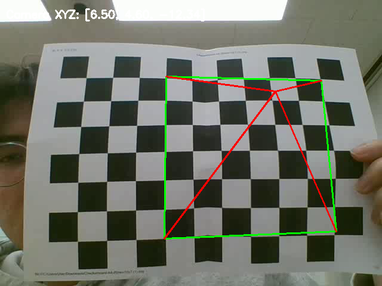

# AR Pyramid with Camera Pose Estimation

This project performs camera pose estimation using chessboard calibration and visualizes a 3D pyramid (augmented reality object) on top of a detected chessboard.

## 🔧 Calibration Info

- **Camera Intrinsic Matrix (K):**

[[619.888, 0, 479.213], [0, 612.992, 312.773], [0, 0, 1]]

- **Distortion Coefficients:**

[-0.6168, 0.8249, -0.0089, -0.0211, -0.5055]

## 📐 Object Details

- **Chessboard Size:** 7 x 10 (inner corners)
- **Square Size:** 1.0 unit
- **3D Object:** A pyramid standing on a 6x6 square base

## 📽 Output

- **AR Video Result:**

`ar_pyramid.avi`

- **Example Frame:**

## ▶ How to Run

1. Prepare a chessboard video: `video_output.avi`
2. Run the script: `python ar_pyramid.py`
3. Output will be saved as `ar_pyramid.avi` and one frame as `image.png`
