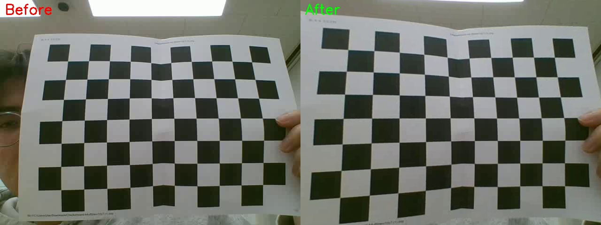

# 📷 Computer Vision Assignment: Camera Calibration & Distortion Correction

본 프로젝트는 컴퓨터 비전 과제로서, 체스보드 영상을 활용한 **카메라 내재 파라미터 보정(Camera Calibration)** 및 **렌즈 왜곡 보정(Distortion Correction)** 을 수행합니다.

---

## ✅ 1. Camera Calibration

체스보드의 여러 시점 영상에서 코너를 추출하여 카메라의 내재 파라미터를 계산합니다.

### 🛠 수행 절차

- `cv.findChessboardCorners()`로 코너 검출
- `cv.calibrateCamera()`로 카메라 매트릭스, 왜곡 계수 계산
- 재투영 오차를 계산하여 정확도 평가

### 📌 Calibration Results

- **사용된 유효 프레임 수**: `78`
- **RMS 재투영 오차**: `0.339263`

#### 🔧 Camera Matrix (K)

[619.8880278431839, 0.0, 479.21308178014766]
[0.0, 612.9917053473229, 312.7732748752825]
[0.0, 0.0, 1.0]

#### 🔍 Distortion Coefficients `[k1, k2, p1, p2, k3]`

[-0.6168214215341291, 0.8249170705983586, -0.008869648423715328, -0.021134863957153003, -0.505503026009792]

#### 🔭 초점 거리 (Focal Length)

- fx = `619.888`
- fy = `612.992`

#### 🎯 주점 위치 (Principal Point)

- cx = `479.213`
- cy = `312.773`

---

## ✅ 2. Distortion Correction

위에서 얻은 보정 파라미터를 활용해 왜곡된 영상을 보정합니다.

### 🛠 수행 절차

- `cv.initUndistortRectifyMap()`으로 보정 맵 생성
- `cv.remap()` 또는 `cv.undistort()`로 보정 적용
- 보정된 영상 출력 및 비교 이미지 저장

### 📷 Before vs After

아래 이미지는 왜곡 보정 전후를 비교한 결과입니다.

| Original (Left)                                     | Corrected (Right) |
| --------------------------------------------------- | ----------------- |
|  |

> 비교 이미지 `distortion_comparison.jpg`는 코드 실행 시 자동 저장됩니다.

---

## 📂 생성 파일 목록

- `calibration_data.txt` : 카메라 매트릭스, 왜곡 계수 등 텍스트 저장
- `callibrated.avi` : 체스보드 탐지 표시된 영상
- `undistorted_output.avi` : 왜곡 보정된 출력 영상
- `distortion_comparison.jpg` : 보정 전후 비교 이미지

---

## ⚙️ 실행 환경

- Python 3.x
- OpenCV (`cv2`)
- NumPy

### 설치 방법:

```bash
pip install opencv-python numpy
```
